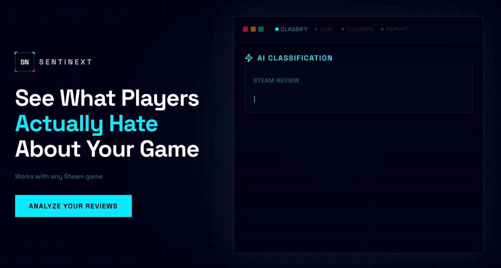
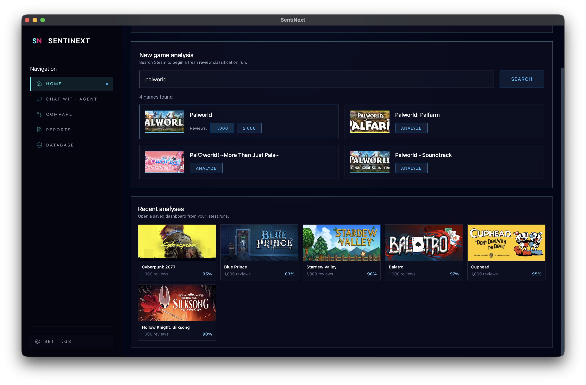
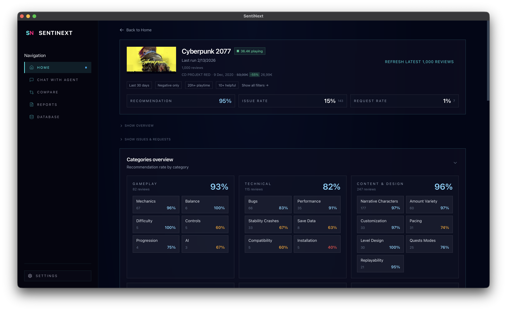

# SentiNext

[](LICENSE)


**Open-source Steam review intelligence for game teams.**

SentiNext turns large volumes of Steam reviews into a clear, prioritized view of what players want you to fix next. It is self-hosted, evidence-driven, and built for teams that need decisions they can defend.

<p align="center">
  
</p>

<p align="center">
  
  <br />
  
</p>

*Search any Steam game, classify reviews with AI, and explore actionable insights.*

## Why SentiNext

- **From noise to signal** — Condense thousands of reviews into a ranked list of issues and feature requests.
- **Evidence you can point to** — Every label is backed by verbatim quotes, so findings stay auditable and defensible.
- **Self-hosted** — Your data never leaves your environment. Run everything locally or on your own infrastructure.
- **Bring your own LLM** — Works with Gemini, xAI Grok, OpenAI, or fully local via Ollama.

## Core Features

- **Review ingestion** — Pull public Steam reviews by game name or App ID and store them in a local SQLite database for repeatable analysis.
- **AI classification** — Label each review into a structured taxonomy (technical, gameplay, content & design, UI/UX, monetization) with issue/request separation and verbatim evidence quotes.
- **Product dashboard** — Track category breakdowns, trend shifts, issue/request rates, and recommendation context with interactive charts.
- **AI chat** — Ask natural-language questions about your review data; the assistant uses tool calls to query and summarize results.
- **Game comparison** — Compare two games side-by-side across all taxonomy categories.
- **Reports** — Export analysis results as PDF or HTML reports.
- **Review explorer** — Full-text search, category filters, and drill-down into individual reviews and their labels.
- **Desktop app** — Native macOS and Windows application built with Tauri — no terminal or Docker required.

## How It Works

1. Search for a Steam game and pull its recent reviews.
2. SentiNext classifies each review with your configured LLM provider.
3. Patterns are aggregated into actionable category-level insights.
4. Explore, filter, and share outcomes from the dashboard.

## Getting Started

### Desktop App

The fastest way to try SentiNext. Download the latest release for your platform — no terminal needed.

**[Download for macOS / Windows](https://github.com/NicoCampa/SentiNext/releases/latest)**

### Docker

**Prerequisites:** [Docker](https://docs.docker.com/get-docker/) and Docker Compose.

```bash
cp .env.example .env.local
# Edit .env.local and set at least one LLM API key
# (GEMINI_API_KEY, XAI_API_KEY, OPENAI_API_KEY, or configure Ollama)

docker compose up --build
```

Open `http://localhost:3000`.

### Manual Setup

**Prerequisites:** Python 3.10+, Node.js 20+.

For full local setup instructions, see [`LOCAL_DEVELOPMENT.md`](LOCAL_DEVELOPMENT.md).

```bash
./run_backend_local.sh
./run_frontend_local.sh
```

## LLM Providers

Set at least one provider. Provider and model can be changed at any time from the Settings page or via `PUT /settings/llm`.

| Provider | Env Variable | Suggested Models |
|----------|--------------|------------------|
| Google Gemini | `GEMINI_API_KEY` | `gemini-flash-lite-latest`, `gemini-flash-latest` |
| xAI Grok | `XAI_API_KEY` | `grok-4-1-fast-non-reasoning`, `grok-4-1-fast-reasoning` |
| OpenAI | `OPENAI_API_KEY` | `gpt-5-mini`, `gpt-5-nano` |
| Ollama (local) | No key needed | `llama3.1:8b`, `qwen2.5:7b`, `gemma2:9b` |

## Configuration

Beyond LLM API keys, these environment variables can be set in `.env.local` (see [`.env.example`](.env.example) for defaults):

| Variable | Description | Default |
|----------|-------------|---------|
| `SENTINEXT_LLM_PROVIDER` | Active LLM provider (`gemini`, `xai`, `openai`, `ollama`) | First configured |
| `SENTINEXT_LLM_MODEL` | Model name for the active provider | Provider default |
| `SENTINEXT_OLLAMA_BASE_URL` | Ollama API endpoint | `http://localhost:11434/v1` |
| `SENTINEXT_LLM_TIMEOUT` | LLM request timeout in seconds | `30` |
| `SENTINEXT_MAX_PARALLEL_BATCHES` | Concurrent review classification threads | `10` |
| `SENTINEXT_ALLOWED_ORIGINS` | Allowed frontend origins (comma-separated) | `http://localhost:3000` |

## Tech Stack

- **Backend:** Python, FastAPI, SQLAlchemy, SQLite (FTS5)
- **Frontend:** Next.js 16, React 19, TypeScript, Tailwind CSS, Chart.js
- **Desktop:** Tauri 2, PyInstaller
- **LLM SDKs:** google-genai, xai-sdk, openai
- **Infrastructure:** Docker Compose

## Project Structure

```
apps/
  api/              FastAPI backend — review ingestion, LLM classification, insights
    senti_next/
      routes/       API route handlers (analysis, games, reviews, chat, settings, misc)
      providers/    LLM provider abstraction (gemini, xai, openai, ollama)
  dashboard/        Next.js product dashboard
  marketing/        Marketing website
desktop/            Tauri desktop app and PyInstaller packaging
tooling/            Benchmarks and internal scripts
infra/              Deployment and build infrastructure
```

## Contributing

Contributions are welcome! If you find a bug or have a feature idea, please open an issue on [GitHub Issues](https://github.com/NicoCampa/SentiNext/issues). To set up a development environment, follow the instructions in [`LOCAL_DEVELOPMENT.md`](LOCAL_DEVELOPMENT.md).

## License

AGPL-3.0. See [`LICENSE`](LICENSE).
